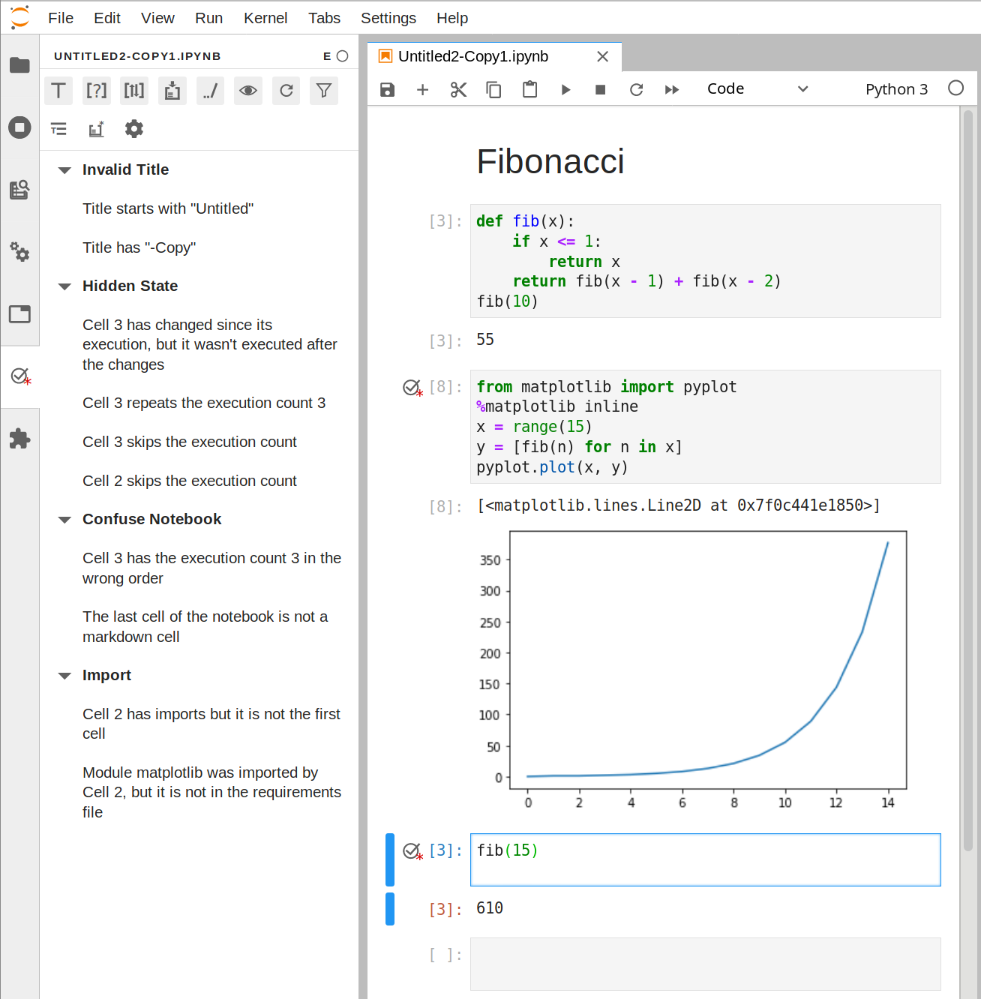

# Julynter


Julynter is a linter for Jupyter Notebooks that aims at improving their Quality and Reproducibility based on the following guidelines [1]:

- Use short titles with a restrict  charset (A-Z a-z 0-9 .-) for notebook  files and markdown headings for more detailed ones in the body.
- Pay attention to the bottom of the  notebook. Check whether it can benefit from descriptive markdown cells or can have code cells executed or removed.
- Abstract code into functions, classes, and modules and test them.
- Declare the dependencies in  requirement files and pin the versions of all packages.
- Use a clean environment for testing the dependencies to check if all of them are declared.
- Put imports at the beginning of the notebooks.
- Use relative paths for accessing data in the repository.
- Re-run notebooks top to bottom  before committing.




This repository provides an extension for Jupyter Lab comprising two parts: a Python package named `julynter`
for the server extension and CLI commands and an NPM package named `@julynter/labextension`
for the frontend extension.


Would you like to participate on a [Julynter experiment](https://dew-uff.github.io/julynter/experiment.html)?


## Team


- João Felipe Pimentel (UFF) (main developer)
- Leonardo Murta (UFF)
- Vanessa Braganholo (UFF)
- Juliana Freire (NYU)


## Publications

- [1] [Pimentel, J. F., Murta, L., Braganholo, V., & Freire, J. (2019, May). A large-scale study about quality and reproducibility of jupyter notebooks. In 2019 IEEE/ACM 16th International Conference on Mining Software Repositories (MSR) (pp. 507-517). IEEE](http://www.ic.uff.br/~leomurta/papers/pimentel2019a.pdf).

## Install

Just install the python package:

```bash
pip install julynter
```

## Running

If you have NodeJS, run Jupyter Lab as usual:
```bash
jupyter lab
```
In the first run, it should detect the installation of Julynter and ask you to rebuild it.


If you do not have NodeJS, run the provided pre-compiled version of Jupyter Lab:
```
julynter lab
```

Julynter appears on the left panel of Jupyter Lab as a circle with a correct sign (). Open it after opening the notebook to start linting.

## CLI

The linting part of Julynter is restricted to the Jupyter Lab extension. However, Julynter also provides a command line interface for other operations:

### Validate

This command checks the linting results stored at the notebook's metadata to indicate whether the notebook is valid (i.e., has no remaining linting messages). For running this command, you must perform the linting before in Jupyter Lab.

```bash
julynter validate <notebook path>
```

This command also has options to view the linting messages in the terminal (`-v 1`) and to display different types of filtered messages (`-t -r -i -m`)

### Run

This command runs a notebook and checks if it reproduces the stored results.

```bash
julynter run <notebook path>
```

It has many options. Some examples:

- Specify the execution order: `-c t` follows the top down order of cells with execution results; `-c a` follows the topdown order, but attempts to execute all cells; `-c e` follows the cell execution count order (i.e, the numbers that appear next to the cells).

- Save a notebook with the new results: `-o <path>`

- Prevent comparing the results: `-x`

- Define normalizer order for cell comparison: `-n <normalizer1> <normalizer2>`

Use `-h` to check the other options.

### Env

This command is similar to `julynter run`: it checks the reproducibility of notebooks in a directory. However, `julynter env` attempts to run the notebooks in a clean virtual environment to check the requirements files' completeness.

```bash
julynter env run venv
```
This command attempts to run all notebooks of the current directory in a new virtual env created by `venv`. Before running, it tries to discover all `setup.py`, `requirements.txt`, and `Pipfile` and install them in the new environment. 

It is possible to specify both a subset of notebooks using arguments after `venv` and a subset of requirement files using the flags `-s <setups>`, `-r <requirements>`, and `-p <pipfiles>`.

For specifying `julynter run` options in the `julynter env` command, use the flag `-o` at the end. For instance, for running the notebooks following the cell execution order:

```bash
julynter env run venv -o -c e
```

In addition to `venv`, julynter supports running the notebooks in a `docker` container or a `conda` environment, if you have these tools installed:
```bash
julynter env run docker
julynter env run conda
```

Each of these commands has specific options:

- `venv` allows to specify the target environment name (`-e <name>`) and the command to create the environment (`-c 'python -m venv'`). You may use the last command to run virtualenv and specify different python versions: `-c 'virtualenv venv --python=python3.8'`
- `docker` allows to specify the base image name (`-e <image>`) and the target directory in the container volume (`-t <path>`).
- `conda` allows to specify the anaconda/miniconda installation path (`-a <path>`), the target environment name (`-e <name>`) and the create arguments (`-c <arguments>`). You may use the create arguments either to specify a python version (`-c 'python=3.8'`) or to clone an existing conda environment (`-c '--clone base'`)

#### Env prepare

After running and checking the reproducibility of the notebooks, `julynter env run` destroys the created environment/container. If you want to create permanent environments/containers, you may run:

```bash
julynter env prepare venv
```

Note, however, that this command will not check the reproducibility of the notebooks.

#### Env import

As an alternative to running all the code in the notebooks and checking its reproducibility, it is possible to use a command for running only the notebooks' import statements to check the completeness of requirements files.

```bash
julynter env import venv
```

(it only works with Python at this moment)

Since this command's goal is to check the possibility of importing modules, I suggest adding the flags `-o -x` to prevent the comparison of results.

Additionally, this command will attempt to run all imports, including conditional imports that should not run in a normal situation. If you want to run only top-level imports, use the following command:

```bash
julynter env importtop venv
```

## Troubleshoot

Known issues:

### Linting list does not update

Sometimes Julynter does not update the linting list after an action. If it occurs, click on the notebook name in the Julynter tab to force a reload.

### External and global options are not recognized

Julynter loads settings from `.julynter/config.json` at the initialization of Jupyter Lab. For reloading it, click on the configuration icon, select `Project settings` in the top and click on `Load`.

User and Project Settings will not apply for existing notebooks that have their individual settings stored as metadata. For updating the settings of these notebooks, click on the configuration icon, select `Project settings` in the top, click on `Load`, select `Notebook settings` in the top, and click on `Save`.

### Some linting messages never appear

Julynter connects to the kernel to perform some checks. When it is not able to connect to the kernel, it indicates "Kernel not found" in the status icon and it does not perform all the checks.

Currently, Julynter only supports the IPython kernel. If you are using a different kernel or programming language that you would like to be fully supported, please submit an issue. If your notebook is connected to a Python kernel, but Julynter still displays this status code, please submit an issue as well.

### Different results

Julynter sends a code to execute on the kernel after every code executed by the user. This code usually does not interfere with the results, since one cell produces a result that is independent of the other. However, it is possible to add stateful-hooks to the execution of cells in the kernel, and the execution of Julynter might interfere with the results.

I noticed it in an ipykernel bug that prevented it from executing post-execution hooks on async cells. Julynter queries received the results of mattplotlib images and did not display them (https://github.com/jupyter/notebook/issues/5568). This bug has been fixed in ipykernel 5.3.1.

If you find a different result in another situation, please submit an issue.

### Frontend extension is not working

If you see the frontend extension, but it is not working, check
that the server extension is enabled:

```bash
jupyter serverextension list
```

### Server extension is installed and enables, but Julynter does not appear

If the server extension is installed and enabled, but you are not seeing
the frontend, check the frontend is installed:

```bash
jupyter labextension list
```

If it is installed, try:

```bash
jupyter lab clean
jupyter lab build
```

### Julynter works with the command julynter lab, but the command jupyter lab started to show exceptions

Jupyter Lab attempts to run NodeJS when an extension is registered. If you do not have NodeJS installed, it will show exceptions in the console. As far as I checked, these exceptions do not cause problems, but if you still want to fix them, there are two possible solutions:

1- Install NodeJS

2- Remove `julynter-labextension-*.tgz` from `sys.prefix\share\jupyter\lab\extensions`

## Supporting other programming languages

By default, Julynter works with Python and supports some basic checks for other programming languages. However, it is possible to create a custom linting kernel using a Comm.

To do it, first create a Comm in the desired programming language using the name `julynter.comm`, specify the receive callback and send a message with the following content:
```json
{"operation": "init"}
```

The interface may send two types of operations:

- query

  ```json
  {
      "operation": "query",
      "requirements": "<requirements.txt file>"
  }
  ```
  
  This operations expects the Julynter kernel to perform the linting

- addModule

  ```json
  {
      "operation": "addModule",
      "requirements": "<requirements.txt file>",
      "module": "<module name>"
  }
  ```

  This operations expects the Julynter kernel to add a module to the requirements file and perform the linting


After processing the operatings, the kernel should reply with the linting result:

```json
{   // consider all the numbers as the cell execution count number
    "operation": "queryResult",
    "executed_code": {1: "<code1>", 2: "<code2">, ...}, // Cell history based on the execution count
    "cell_dependencies": { // Map of maps
        3: {
            "a": 1, // cell 3 depends on the definition of 'a' in cell 1 
            "b": 2
        }
    },
    "missing_dependencies": {
        1: ["c", "d"] // 'c' and 'd' appear on cell 1, but they were not defined
    },
    "absolute_paths": {
        1: ["/home/"] // cell 1 has the absolute path /home
    },
    "has_imports": [2, 3], // execution counts with imports
    "missing_requirements": { // Map of maps
        2: {
            "numpy": { // Module numpy that is imported by cell 2 is not on requirements
                "status": 3,
                "msg": "Module not found on requirements.txt"
            }
        }
    }
}
```

If there is any error during linting, the kernel may replay with an error:
```json
{
    "operation": "error",
    "command": "<operation that caused the error>",
    "message": "<error message>"
}

After defining the Comm, you may set the Julynter interface to automatically execute your Julynter kernel for a programming language, by configuring the Julynter options in `~/.julynter/config.json`:

```json
{
    ...
    "options": {
        ...
        "kernel": {
            "order": ["<newkernel>", "python", "default"],
            "values": {
                "<newkernel>": {
                    "language": "<regex to identify language>",
                    "initScript": "<command to create Julynter kernel Comm>",
                    "name": "<kernel name>",
                },
                "python": {
                    "language": "python",
                    "initScript": "import julynter.kernel; julynter.kernel.init()",
                    "name": "python"
                },
                "default": {
                    "kernel": ".*",
                    "initScript": null,
                    "name": "default"
                }
            }
        }
    }
}
```


## Contributing

Pull requests for bugfixes and new features are welcome! 

### Install

The `jlpm` command is JupyterLab's pinned version of
[yarn](https://yarnpkg.com/) that is installed with JupyterLab. You may use
`yarn` or `npm` in lieu of `jlpm` below.

```bash
# Clone the repo to your local environment
# Move to julynter directory

# Install server extension
pip install -e .
# Register server extension
jupyter serverextension enable --py julynter --sys-prefix

# Install dependencies
jlpm
# Build Typescript source
jlpm build
# Link your development version of the extension with JupyterLab
jupyter labextension link .
# Rebuild Typescript source after making changes
jlpm build
# Rebuild JupyterLab after making any changes
jupyter lab build
```

You can watch the source directory and run JupyterLab in watch mode to watch for changes in the extension's source and automatically rebuild the extension and application.

```bash
# Watch the source directory in another terminal tab
jlpm watch
# Run jupyterlab in watch mode in one terminal tab
jupyter lab --watch
```

### Uninstall

```bash
pip uninstall julynter
jupyter labextension uninstall julynter
```

### Publishing Package

(Self notes)

Publish NPM package:

```bash
npm login
npm publish --access public
```

Create local Julynterlab:
```bash
rm -rf julynter/julynterlab
./create_julynterlab.sh
```


Publish PyPI package:
```bash
rm -rf build
python setup.py bdist_wheel
twine upload dist/*
```